# BẢN ĐỒ TRANG WEB (SITEMAP) - GRADIE WEBSITE

Tài liệu này mô tả chi tiết toàn bộ cấu trúc các trang, phân hệ chức năng, sơ đồ liên kết và luồng đi của từng tab/trang trong dự án Gradie.

---

## 🗺️ 1. SƠ ĐỒ TỔNG QUAN (MERMAID FLOWCHART)

```mermaid
graph TD
    %% Main Sections
    Home[Trang Chủ - index.html]
    Auth[Xác Thực - login/signup.html]
    Client[Phân Hệ Khách Hàng - Client]
    Admin[Phân Hệ Quản Trị - Admin CMS]

    Home --> Auth
    Home --> Client
    Auth -->|Quyền Admin/Manager| Admin

    %% Client Tab Flow
    subgraph Client Pages [Các Trang Khách Hàng]
        direction TB
        Products[Sản Phẩm - products.html]
        Detail[Chi Tiết Sản Phẩm - product-detail.html]
        Customize[Tự Thiết Kế - customize.html]
        DIYSash[Thiết Kế Băng Đeo - diy-sash-design.html]
        Services[Dịch Vụ Quà Tặng]
        Gallery[Bộ Sưu Tập - gallery.html]
        BrandStory[Về Gradie - brand-story.html]
        Blog[Blog / Tin Tức - blog.html]
        Cart[Giỏ Hàng - cart.html]
        Checkout[Thanh Toán - checkout.html]
        OrderTrack[Theo Dõi Đơn - order-tracking.html]
    end

    Home --> Products
    Home --> Customize
    Home --> Services
    Home --> Gallery
    Home --> BrandStory
    Home --> Blog

    Products --> Detail
    Detail --> Cart
    Cart --> Checkout
    Checkout --> OrderTrack

    %% Admin Tab Flow
    subgraph Admin Pages [Bảng Điều Khiển Admin CMS]
        direction TB
        Dash[Bảng Điều Khiển - admin-dashboard.html]
        Analytic[Phân Tích - admin-analytics.html]
        AdProd[Quản Lý Sản Phẩm - admin-products.html]
        AdCat[Quản Lý Danh Mục - admin-categories.html]
        AdBlog[Quản Lý Bài Viết - admin-blog.html]
        AdGall[Quản Lý Gallery - admin-gallery.html]
        AdOrder[Quản Lý Đơn Hàng - admin-orders.html]
        AdUser[Quản Lý Người Dùng - admin-users.html]
        AdCust[Cấu Hình Cá Nhân Hóa - admin-customize.html]
        AdStaff[Quản Lý Nhân Sự - admin-staff.html]
        AdPolicy[Cấu Hình Chính Sách - admin-policies.html]
        AdSet[Cài Đặt Cửa Hàng - admin-settings.html]
    end

    Admin --> Dash
    Dash --> Analytic
    Dash --> AdProd
    Dash --> AdOrder
    Dash --> AdSet
```

---

## 👥 2. PHÂN HỆ KHÁCH HÀNG (CLIENT WEB)

Hệ thống menu điều hướng trên Header (các Tab chính) và Footer liên kết đến các trang sau:

### 🌟 A. Các Tab trên Menu Chính (Header Navigation)
| Tên Trang / Tab | File HTML | Tệp Logic (JS) | Mô tả chức năng |
| :--- | :--- | :--- | :--- |
| **Trang Chủ** | `index.html` | `js/main.js` | Trang giới thiệu chính, banner động, sản phẩm nổi bật, dịch vụ tiêu biểu. |
| **Sản Phẩm** | `products.html` | `js/products.js` | Danh sách bộ lọc sản phẩm, tìm kiếm, phân loại theo danh mục. |
| **Tự Thiết Kế** | `customize.html` | `js/customize.js` | Tổng hợp dịch vụ tự thiết kế quà tặng tốt nghiệp cá nhân hóa. |
| **Góc Khách Hàng** | `gallery.html` | `js/gallery.js` | Bộ sưu tập hình ảnh, feedback thực tế từ học sinh, sinh viên. |
| **Về Chúng Tôi** | `brand-story.html` | - | Giới thiệu câu chuyện thương hiệu, nguồn gốc và đội ngũ sáng lập Gradie. |
| **Góc Cảm Hứng** | `blog.html` | `js/blog.js` | Trang tin tức, cẩm nang chọn quà tặng tốt nghiệp. |

### 🛠️ B. Dịch Vụ Cá Nhân Hóa (Services)
Nằm trong menu con của dịch vụ hoặc liên kết từ trang Tùy chỉnh:
*   **Thiết Kế Băng Đeo (Sash)**: `diy-sash-design.html` & `js/diy-sash-design.js` (Bộ công cụ kéo/thả, chọn màu vải, viền, thêu chữ trực quan).
*   **Dịch Vụ Thêu Tên**: `embroidery-services.html` (Đặt thêu chữ lên gấu bông tốt nghiệp, trang phục).
*   **Dịch Vụ Khắc Tên**: `engraving-services.html` (Khắc laser logo, tên lên bình giữ nhiệt, hộp gỗ).
*   **Gói Quà Sang Trọng**: `gift-wrapping.html` (Dịch vụ đóng hộp quà cao cấp, sáp seal, ruy băng).

### 🏷️ C. Danh Mục Sản Phẩm Chuyên Biệt
Các trang lọc nhanh sản phẩm theo chủ đề tốt nghiệp:
*   `graduation-sashes.html`: Băng đeo tốt nghiệp (Sash).
*   `personalized-plushies.html`: Thú bông tốt nghiệp thêu tên.
*   `accessories-jewelry.html`: Phụ kiện & Trang sức.
*   `gift-combos-flowers.html`: Combo quà tặng & Hoa sáp/hoa tươi.
*   `unique-gifts.html`: Quà tặng tốt nghiệp độc bản.

### 🛒 D. Luồng Mua Hàng & Tài Khoản (Checkout Flow)
*   **Chi Tiết Sản Phẩm**: `product-detail.html` (Hiển thị chi tiết, đánh giá của khách, cấu hình lựa chọn thêu/khắc).
*   **Giỏ Hàng**: `cart.html` & `js/cart.js` (Xem lại sản phẩm đã chọn, số lượng, tùy chỉnh thêu khắc đi kèm).
*   **Thanh Toán**: `checkout.html` & `js/checkout.js` (Nhập thông tin giao hàng, chọn thanh toán COD/chuyển khoản VietQR).
*   **Theo Dõi Đơn Hàng**: `order-tracking.html` & `js/order-tracking.js` (Tra cứu trạng thái xử lý đơn hàng thời gian thực).
*   **Tài Khoản Khách Hàng**: `account.html` & `js/account.js` (Lịch sử mua hàng, tích lũy điểm thưởng, thông tin cá nhân).

### 📄 E. Các Trang Thông Tin Khác (Footer & Thông tin bổ trợ)
*   `about.html` / `mission.html`: Sứ mệnh và tầm nhìn của Gradie.
*   `contact.html`: Bản đồ cửa hàng, thông tin liên lạc, form gửi email.
*   `customer-photos.html` / `photoshoot-concepts.html`: Ý tưởng chụp ảnh tốt nghiệp, hình ảnh thực tế.
*   `gifting-tips.html` / `meaning-of-gifts.html`: Cẩm nang tặng quà và ý nghĩa của từng món quà tốt nghiệp.
*   `store-policy.html` / `policies.html`: Điều khoản đổi trả, giao hàng và bảo mật.

---

## 🔒 3. PHÂN HỆ QUẢN TRỊ (ADMIN CMS)

Được quản lý thông qua trang Đăng Nhập: `login.html` & `js/admin-auth.js`. Sau khi đăng nhập thành công vào nhánh Admin, thanh Sidebar chứa các tab sau:

### 📊 A. Nhóm Tổng Quan (Overview)
*   **Bảng Điều Khiển (`admin-dashboard.html` / `js/admin-dashboard.js`)**: Số liệu tổng hợp nhanh trong ngày.
*   **Phân Tích Doanh Thu (`admin-analytics.html` / `js/admin-analytics.js`)**: Biểu đồ doanh số chi tiết.

### ✍️ B. Nhóm Quản Lý Nội Dung (Content)
*   **Sản Phẩm (`admin-products.html` / `js/admin-products.js`)**: Thêm mới, chỉnh sửa thông tin, giá, ảnh, trạng thái tồn kho của sản phẩm.
    *   *Liên kết phụ*: `admin-product-form.html` (Giao diện biên tập/tạo mới sản phẩm).
*   **Danh Mục (`admin-categories.html` / `js/admin-categories.js`)**: Quản lý cây danh mục sản phẩm.
*   **Bài Viết (`admin-blog.html` / `js/admin-blog.js`)**: Quản lý tin tức, cẩm nang chọn quà.
*   **Bộ Sưu Tập (`admin-gallery.html` / `js/admin-gallery.js`)**: Quản lý hình ảnh và feedback khách hàng.

### 🚚 C. Nhóm Vận Hành (Operations)
*   **Đơn Hàng (`admin-orders.html` / `js/admin-orders.js`)**: Cập nhật trạng thái đơn (Pending -> Preparing -> Shipped -> Delivered -> Cancelled), in hóa đơn, xử lý yêu cầu cá nhân hóa (thêu/khắc).
*   **Người Dùng (`admin-users.html` / `js/admin-users.js`)**: Danh sách khách hàng và lịch sử tương tác.
*   **Cá Nhân Hóa (`admin-customize.html` / `js/admin-customize.js`)**: Cấu hình bảng màu, phông chữ thêu/khắc, bảng giá dịch vụ Sash.

### ⚙️ D. Nhóm Hệ Thống (System Config)
*   **Nhân Sự (`admin-staff.html` / `js/admin-staff.js`)**: Phân quyền nhân viên (Manager, Sales, Warehouse, Accountant).
*   **Chính Sách (`admin-policies.html` / `js/admin-policies.js`)**: Quản lý nội dung chính sách cửa hàng hiển thị ngoài trang chủ.
*   **Cài Đặt (`admin-settings.html` / `js/admin-settings.js`)**: Cấu hình SEO, thông tin liên hệ cửa hàng, tích hợp API (Tiki, Lazada, TikTok Shop).
