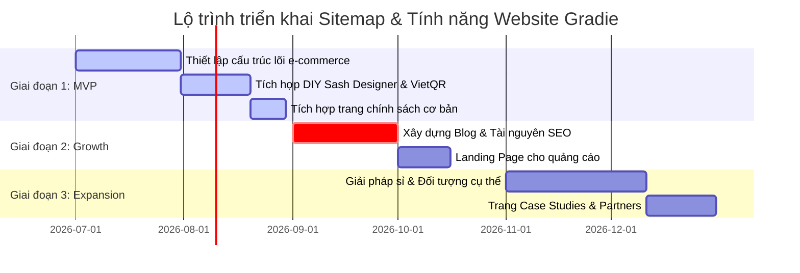

# ĐỀ XUẤT SITEMAP DỰ ÁN GRADIE
**Vai trò:** Chuyên gia UX, SEO và Kiến trúc thông tin (Information Architecture).  
**Dự án:** Website Thương mại Điện tử Quà tặng Tốt nghiệp & Dịch vụ Cá nhân hóa Gradie.


---

## 🌳 PHẦN 1: SITEMAP DẠNG CÂY (HIERARCHICAL SITEMAP)

Cấu trúc phân cấp tối ưu hóa cho hành trình khách hàng (khách lẻ và khách sỉ/trường học) và công cụ tìm kiếm (Search Engines), đảm bảo quy tắc **tối đa 3 lần nhấp chuột** từ trang chủ đến bất kỳ trang quan trọng nào.

```
🏠 [Trang Cấp 1] TRANG CHỦ (/)
 ├── 🧸 [Trang Cấp 2] DANH MỤC SẢN PHẨM (/cua-hang)
 │    ├── 🎓 [Trang Cấp 3] Băng Đeo Tốt Nghiệp / Sash (/cua-hang/bang-deo-tot-nghiep)
 │    ├── 🧸 [Trang Cấp 3] Thú Bông Cử Nhân Thêu Tên (/cua-hang/thu-bong-tot-nghiep)
 │    ├── 💐 [Trang Cấp 3] Combo Quà & Hoa (/cua-hang/combo-qua-tang-va-hoa)
 │    ├── 🏅 [Trang Cấp 3] Huy Chương & Phụ Kiện (/cua-hang/huy-chuong-va-phu-kien)
 │    ├── 🖼️ [Trang Cấp 3] Khung Ảnh Kỷ Niệm (/cua-hang/khung-anh-ky-niem)
 │    └── 📦 [Trang Cấp 3] Chi Tiết Sản Phẩm (/cua-hang/[product-slug])
 │
 ├── 🪄 [Trang Cấp 2] TÍNH NĂNG CÁ NHÂN HÓA (/tinh-nang)
 │    ├── 🧵 [Trang Cấp 3] Dịch Vụ Thêu Tên (/tinh-nang/dich-vu-theu-ten)
 │    ├── ✒️ [Trang Cấp 3] Dịch Vụ Khắc Chữ Laser (/tinh-nang/dich-vu-khac-chu-laser)
 │    ├── 🎁 [Trang Cấp 3] Gói Quà Nghệ Thuật (/tinh-nang/art-gift-wrapping)
 │    └── ✂️ [Trang Cấp 3] Studio Tự Thiết Kế Sash (/tinh-nang/tu-thiet-ke-sash-online)
 │
 ├── 🏢 [Trang Cấp 2] GIẢI PHÁP / SOLUTIONS (/giai-phap)
 │    ├── 🏫 [Trang Cấp 3] Quà Tặng Cho Trường Học (/giai-phap/truong-hoc-va-vien-dao-tao)
 │    └── 💼 [Trang Cấp 3] Quà Tặng Cho Doanh Nghiệp & Nhà Tài Trợ (/giai-phap/doanh-nghiep)
 │
 ├── 🎓 [Trang Cấp 2] PHÂN NHÓM ĐỐI TƯỢNG / INDUSTRIES (/doi-tuong)
 │    ├── 🏛️ [Trang Cấp 3] Đại Học & Cao Đẳng (/doi-tuong/dai-hoc-cao-dang)
 │    ├── 🏫 [Trang Cấp 3] Trung Học Phổ Thông & THCS (/doi-tuong/thpt-thcs)
 │    └── 🧸 [Trang Cấp 3] Mầm Non & Tiểu Học (/doi-tuong/mam-non-tieu-hoc)
 │
 ├── 🏷️ [Trang Cấp 2] BẢNG GIÁ & ƯU ĐÃI (/bang-gia)
 │    ├── 💸 [Trang Cấp 3] Bảng Giá Cá Nhân Hóa Lẻ (/bang-gia/dich-vu-ca-nhan-hoa)
 │    └── 🤝 [Trang Cấp 3] Chiết Khấu Số Lượng Lớn (/bang-gia/chiet-khau-si)
 │
 ├── 📚 [Trang Cấp 2] TÀI NGUYÊN HỖ TRỢ / RESOURCES (/tai-nguyen)
 │    ├── 📐 [Trang Cấp 3] Hướng Dẫn Chọn Kích Thước Sash (/tai-nguyen/huong-dan-size-sash)
 │    └── 🧵 [Trang Cấp 3] Catalog Font Chữ & Bảng Màu Chỉ (/tai-nguyen/catalog-font-mau-chi)
 │
 ├── 📖 [Trang Cấp 2] BLOG - GÓC CẢM HỨNG (/blog)
 │    ├── 💡 [Trang Cấp 3] Mẹo Chọn Quà Tốt Nghiệp (/blog/meo-chon-qua)
 │    ├── 🎓 [Trang Cấp 3] Ý Nghĩa Quà Tặng Kỷ Niệm (/blog/y-nghia-qua-tang)
 │    └── 📸 [Trang Cấp 3] Ý Tưởng Chụp Ảnh Kỷ Yếu (/blog/y-tuong-chup-anh-ky-yeu)
 │
 ├── 🏆 [Trang Cấp 2] DỰ ÁN TIÊU BIỂU / CASE STUDIES (/du-an-thuc-te)
 │    ├── 🎓 [Trang Cấp 3] Dự án Sash Tốt Nghiệp Đại học Ngoại Thương (/du-an-thuc-te/sash-tot-nghiep-ftu)
 │    └── 🧸 [Trang Cấp 3] Dự án Gấu bông Cử nhân ĐH Kinh Tế Quốc Dân (/du-an-thuc-te/gau-bong-cu-nhan-neu)
 │
 ├── 🤝 [Trang Cấp 2] ĐỐI TÁC HỢP TÁC / PARTNERS (/hop-tac-dai-su)
 ├── 💼 [Trang Cấp 2] TUYỂN DỤNG / CAREERS (/tuyen-dung)
 ├── ℹ️ [Trang Cấp 2] VỀ CHÚNG TÔI / ABOUT US (/ve-chung-toi)
 ├── 📞 [Trang Cấp 2] LIÊN HỆ / CONTACT (/lien-he)
 ├── 🛡️ [Trang Cấp 2] TRANG PHÁP LÝ & ĐIỀU KHOẢN (/chinh-sach)
 │    ├── 🔄 [Trang Cấp 3] Chính Sách Đổi Trả & Bảo Hành Thêu Khắc (/chinh-sach/doi-tra-bao-hanh)
 │    ├── 🚚 [Trang Cấp 3] Chính Sách Vận Chuyển Hỏa Tốc (/chinh-sach/van-chuyen-giao-nhan)
 │    └── 🔒 [Trang Cấp 3] Chính Sách Bảo Mật Thông Tin (/chinh-sach/bao-mat-thong-tin)
 │
 └── 🚀 [Trang Cấp 2] LANDING PAGES QUẢNG CÁO & SEO (/landing-page)
      ├── 🎯 [Trang Cấp 3] Dịch Vụ Đặt Làm Sash Thiết Kế Riêng (/landing-page/dat-lam-sash-tot-nghiep)
      └── 🎯 [Trang Cấp 3] Quà Tặng Gấu Bông Tốt Nghiệp Thêu Tên (/landing-page/gau-bong-tot-nghiep-theu-ten)
```

---

## 📊 PHẦN 2: BẢNG CHI TIẾT TỪNG TRANG (PAGE MATRIX)

| ID | Tên Trang | URL Slug | Phân Loại Trang | Mục Tiêu Trang | Đối Tượng Người Dùng | Nội Dung Chính | CTA Chính | Focus Keyword | Internal Links khuyên dùng |
| :--- | :--- | :--- | :--- | :--- | :--- | :--- | :--- | :--- | :--- |
| **01** | **Trang Chủ** | `/` | Trang chuyển đổi | Định vị thương hiệu, điều hướng nhanh đến danh mục bán chạy & các dịch vụ cá nhân hóa. | Học sinh, sinh viên, người thân mua quà, trường học/doanh nghiệp tìm đối tác. | Hero banner, Lối tắt đến 3 sản phẩm hot, Khối giới thiệu công cụ DIY Sash, Trích dẫn đánh giá của sinh viên FTU/NEU, Bản đồ hệ thống cửa hàng. | `Tự thiết kế ngay` & `Xem sản phẩm bán chạy` | quà tặng tốt nghiệp | `/cua-hang`, `/tinh-nang/tu-thiet-ke-sash-online`, `/ve-chung-toi` |
| **02** | **Về Chúng Tôi** | `/ve-chung-toi` | Trang cung cấp thông tin | Kể câu chuyện thương hiệu Gradie, truyền tải sứ mệnh và cam kết chất lượng của thợ thủ công. | Khách hàng coi trọng chất lượng sản phẩm cá nhân hóa, đối tác doanh nghiệp. | Lịch sử hình thành Gradie, Quy trình tuyển chọn sợi chỉ thêu cao cấp và kỹ thuật khắc laser, Sứ mệnh thương hiệu, Hình ảnh xưởng sản xuất thực tế. | `Khám phá bộ sưu tập` | về thương hiệu gradie | `/cua-hang`, `/tinh-nang/tu-thiet-ke-sash-online` |
| **03** | **Cửa Hàng (Tất Cả Sản Phẩm)** | `/cua-hang` | Trang chuyển đổi | Nơi tìm kiếm, lọc và xem toàn bộ danh mục sản phẩm quà tốt nghiệp. | Mọi khách hàng có nhu cầu mua sản phẩm đơn lẻ hoặc combo. | Grid sản phẩm, bộ lọc danh mục (Gấu bông, Sash, Hoa mừng, Phụ kiện), thanh tìm kiếm nhanh, bộ lọc sắp xếp giá. | `Mua ngay` (trên thẻ sản phẩm) | shop quà tốt nghiệp | `/cua-hang/bang-deo-tot-nghiep`, `/cua-hang/thu-bong-tot-nghiep` |
| **04** | **Băng Đeo Tốt Nghiệp / Sash** | `/cua-hang/bang-deo-tot-nghiep` | Trang SEO & Chuyển đổi | Bán hàng và SEO từ khóa chuyên biệt về dải băng tốt nghiệp (Sash). | Học sinh cuối cấp, ban đại diện phụ huynh, ban tổ chức sự kiện tốt nghiệp của trường. | Danh sách sản phẩm Sash có sẵn (trơn, viền ren, viền kim tuyến), tùy chọn cá nhân hóa kèm theo, liên kết dẫn đến công cụ DIY thiết kế tự do. | `Tự tay thiết kế` | băng đeo tốt nghiệp | `/tinh-nang/tu-thiet-ke-sash-online`, `/tai-nguyen/huong-dan-size-sash` |
| **05** | **Thú Bông Cử Nhân Thêu Tên** | `/cua-hang/thu-bong-tot-nghiep` | Trang SEO & Chuyển đổi | Bán hàng và SEO từ khóa gấu bông tốt nghiệp. | Bạn bè, người thân mua quà tặng tân cử nhân. | Các loại thú bông (Teddy, Capybara cử nhân, gấu trúc tốt nghiệp), tùy chỉnh tên thêu trên áo cử nhân hoặc mũ, bảng chọn font chỉ. | `Đặt thêu tên ngay` | gấu bông tốt nghiệp thêu tên | `/tinh-nang/dich-vu-theu-ten`, `/tai-nguyen/catalog-font-mau-chi` |
| **06** | **Chi Tiết Sản Phẩm** | `/cua-hang/[product-slug]` | Trang chuyển đổi | Cung cấp toàn bộ thông số sản phẩm, bảng tùy chỉnh cá nhân hóa và nút thêm vào giỏ hàng. | Khách hàng đã chọn được sản phẩm cụ thể. | Ảnh gallery phóng to, mô tả chi tiết, form nhập thông tin cá nhân hóa (văn bản thêu, màu chỉ, phông chữ), đánh giá thực tế từ khách đã mua. | `Thêm vào giỏ hàng` | [Tên sản phẩm tốt nghiệp] | `/cart`, `/chinh-sach/doi-tra-bao-hanh` |
| **07** | **Studio Tự Thiết Kế Sash Online** | `/tinh-nang/tu-thiet-ke-sash-online` | Trang chuyển đổi | Trải nghiệm tương tác thiết kế Sash tốt nghiệp thời gian thực. | Học sinh, sinh viên muốn có dải băng độc bản, thiết kế cá nhân. | Canvas tương tác đổi màu vải băng, màu viền, nhập văn bản, xem preview 3D, chọn phông chữ và tính toán giá tự động. | `Thêm mẫu thiết kế vào giỏ` | tự thiết kế băng tốt nghiệp | `/tai-nguyen/huong-dan-size-sash`, `/tai-nguyen/catalog-font-mau-chi` |
| **08** | **Quà Tặng Cho Trường Học** | `/giai-phap/truong-hoc-va-vien-dao-tao` | Trang SEO | Thu hút khách hàng sỉ tổ chức lễ tốt nghiệp cho trường học. | Ban giám hiệu, phòng công tác sinh viên, hội cựu sinh viên. | Catalogue quà tặng số lượng lớn (Sash thêu logo trường, huy chương danh dự, bộ quà tặng cao cấp), chính sách chiết khấu, hình thức ký kết hợp đồng. | `Nhận báo giá sỉ` | sản xuất băng tốt nghiệp số lượng lớn | `/bang-gia/chiet-khau-si`, `/du-an-thuc-te/sash-tot-nghiep-ftu` |
| **09** | **Đại Học & Cao Đẳng** | `/doi-tuong/dai-hoc-cao-dang` | Trang SEO | Tiếp cận thị trường sinh viên đại học chuẩn bị tốt nghiệp. | Sinh viên năm cuối, ban đại diện khóa. | Các dự án Sash và quà tặng mẫu của các trường đại học lớn (FTU, NEU, HUST, RMIT), các mẫu Sash trang trọng tiêu chuẩn quốc tế. | `Khám phá mẫu đại học` | ruy băng tốt nghiệp đại học | `/du-an-thuc-te/sash-tot-nghiep-ftu`, `/cua-hang/bang-deo-tot-nghiep` |
| **10** | **Bảng Giá Cá Nhân Hóa Lẻ** | `/bang-gia/dich-vu-ca-nhan-hoa` | Trang cung cấp thông tin | Cung cấp thông tin giá dịch vụ thêu tên, khắc chữ laser và dịch vụ gói quà nghệ thuật. | Khách lẻ muốn biết rõ phụ phí trước khi tiến hành cá nhân hóa sản phẩm. | Bảng giá chi tiết dịch vụ thêu (theo ký tự/logo), giá dịch vụ khắc laser trên gỗ/kim loại, các mức giá gói quà kèm phụ kiện sáp seal. | `Đến trang sản phẩm` | bảng giá thêu tên gấu tốt nghiệp | `/cua-hang`, `/tinh-nang/tu-thiet-ke-sash-online` |
| **11** | **Chi Tiết Dự Án Tiêu Biểu (FTU)** | `/du-an-thuc-te/sash-tot-nghiep-ftu` | Trang SEO & Chuyển đổi | Chứng minh năng lực sản xuất thực tế bằng hình ảnh dự án lớn cho ĐH Ngoại Thương. | Trường học, ban tổ chức sự kiện cần chứng thực năng lực nhà cung cấp. | Đề bài từ ĐH Ngoại Thương, giải pháp phối màu đỏ burgundy chủ đạo của trường, hình ảnh sinh viên mặc lễ phục đeo Sash trong buổi lễ, đánh giá từ ban giám hiệu. | `Yêu cầu thiết kế tương tự` | đặt làm sash tốt nghiệp ftu | `/giai-phap/truong-hoc-va-vien-dao-tao`, `/bang-gia/chiet-khau-si` |
| **12** | **Liên Hệ** | `/lien-he` | Trang hỗ trợ | Hỗ trợ giải đáp thắc mắc, cung cấp thông tin liên hệ và biểu mẫu gửi yêu cầu. | Khách hàng cần hỗ trợ giao gấp hoặc đặt hàng thiết kế riêng biệt. | Số điện thoại Hotline, địa chỉ cửa hàng thực tế, email hỗ trợ, biểu mẫu gửi thông tin liên hệ nhanh, tích hợp bản đồ Google Maps. | `Gửi tin nhắn hỗ trợ` | liên hệ gradie | `/cua-hang`, `/chinh-sach/van-chuyen-giao-nhan` |
| **13** | **Chính Sách Đổi Trả & Bảo Hành** | `/chinh-sach/doi-tra-bao-hanh` | Trang pháp lý | Bảo vệ quyền lợi người tiêu dùng, cam kết bảo hành các chi tiết thêu/khắc lỗi do sản xuất. | Khách hàng chuẩn bị đặt mua dịch vụ cá nhân hóa. | Các quy định về đổi trả sản phẩm không cá nhân hóa, chính sách sửa lỗi chỉ thêu/khắc sai ký tự so với đơn đặt hàng trong 7 ngày. | `Quay lại mua sắm` | chính sách bảo hành thêu khắc gradie | `/cua-hang`, `/lien-he` |
| **14** | **Landing Page: Đặt Làm Sash Thiết Kế Riêng** | `/landing-page/dat-lam-sash-tot-nghiep` | Trang SEO | Landing page tối ưu chuyển đổi từ quảng cáo Google/Facebook cho dịch vụ đặt làm Sash. | Khách hàng tìm kiếm dịch vụ đặt in/thêu băng đeo tốt nghiệp gấp. | Tiêu đề cuốn hút, hình ảnh sản phẩm thực tế sắc nét, nút dẫn trực tiếp vào bộ tùy chọn thiết kế nhanh, form đăng ký nhận ưu đãi nhóm. | `Thiết kế Sash của bạn ngay` | làm băng đeo tốt nghiệp theo yêu cầu | `/tinh-nang/tu-thiet-ke-sash-online`, `/tai-nguyen/huong-dan-size-sash` |

---

## 🧭 PHẦN 3: ĐỀ XUẤT ĐIỀU HƯỚNG VÀ LỘ TRÌNH TRIỂN KHAI

### 3.1 Cấu trúc Menu Điều hướng (Navigation Proposal)

#### A. Menu Chính (Header Navigation)
Thiết kế tối giản, tập trung vào hành vi chuyển đổi nhanh:
1.  **Trang Chủ** (`/`)
2.  **Cửa Hàng** (`/cua-hang`)
    *   *Dropdown*: Băng Đeo Tốt Nghiệp | Gấu Bông Thêu Tên | Combo Quà & Hoa | Khung Ảnh Kỷ Niệm
3.  **Tự Thiết Kế Sash** (`/tinh-nang/tu-thiet-ke-sash-online`) *(Nút CTA nổi bật nhất trên thanh menu)*
4.  **Giải Pháp Sỉ** (`/giai-phap`)
    *   *Dropdown*: Quà tặng trường học | Quà tặng doanh nghiệp
5.  **Góc Khách Hàng (Gallery)** (`/gallery.html`)
6.  **Liên Hệ** (`/lien-he`)

#### B. Menu Chân Trang (Footer Navigation)
Chia làm 4 cột rõ ràng hỗ trợ tối ưu SEO Footer link:
*   **Cột 1: Về Gradie**
    *   Câu chuyện thương hiệu (`/ve-chung-toi`)
    *   Sứ mệnh & tầm nhìn (`/mission.html`)
    *   Cơ hội nghề nghiệp (`/tuyen-dung`)
*   **Cột 2: Sản phẩm bán chạy**
    *   Băng đeo tốt nghiệp thêu tên (`/cua-hang/bang-deo-tot-nghiep`)
    *   Gấu bông tốt nghiệp cao cấp (`/cua-hang/thu-bong-tot-nghiep`)
    *   Combo quà tặng cử nhân (`/cua-hang/combo-qua-tang-va-hoa`)
*   **Cột 3: Hỗ trợ khách hàng**
    *   Chính sách đổi trả & bảo hành thêu khắc (`/chinh-sach/doi-tra-bao-hanh`)
    *   Chính sách giao hàng hỏa tốc (`/chinh-sach/van-chuyen-giao-nhan`)
    *   Hướng dẫn đo size Sash (`/tai-nguyen/huong-dan-size-sash`)
*   **Cột 4: Blog & Tài nguyên**
    *   Góc cảm hứng & tin tức (`/blog`)
    *   Ý tưởng chụp ảnh kỷ yếu (`/blog/y-tuong-chup-anh-ky-yeu`)
    *   Chính sách bảo mật (`/chinh-sach/bao-mat-thong-tin`)

#### C. Đường dẫn Breadcrumb (Breadcrumb Trails)
Hỗ trợ bot tìm kiếm thu thập thông tin và giúp người dùng không bao giờ bị lạc:
*   *Trang chi tiết sản phẩm:* `Trang chủ` > `Cửa hàng` > `Tên danh mục` > `Tên sản phẩm` (Ví dụ: `Trang chủ` > `Cửa hàng` > `Băng đeo tốt nghiệp` > `Băng Đeo Tốt Nghiệp Satin Viền Ren Kim Tuyến`)
*   *Trang dự án thực tế:* `Trang chủ` > `Dự án tiêu biểu` > `Sash tốt nghiệp FTU`
*   *Trang tin tức:* `Trang chủ` > `Góc cảm hứng` > `Ý tưởng chụp ảnh kỷ yếu`

---

### 3.2 Lộ trình Triển khai theo 3 Giai đoạn (Deployment Roadmap)



#### 🚀 Giai đoạn 1: MVP (Minimum Viable Product) - Tập trung chuyển đổi cốt lõi
*   **Danh sách trang triển khai:** Trang chủ, Cửa hàng (Tất cả sản phẩm), Chi tiết sản phẩm, Studio tự thiết kế Sash online, Giỏ hàng, Thanh toán (quét mã VietQR), Theo dõi đơn hàng, Liên hệ, Chính sách đổi trả & bảo hành.
*   **Mục tiêu:** Vận hành trơn tru luồng đặt hàng và cá nhân hóa sản phẩm của khách lẻ. Đảm bảo cấu hình thanh toán tự động hoạt động ổn định.

#### 📈 Giai đoạn 2: Growth (Tối ưu hóa SEO & Quảng cáo)
*   **Danh sách trang triển khai:** Blog (Mẹo chọn quà, Ý tưởng chụp ảnh), Hướng dẫn chọn size Sash, Catalog font chữ và chỉ thêu, Landing Pages phục vụ các chiến dịch chạy quảng cáo Google Ads/Facebook Ads cho dịch vụ Sash và Gấu bông thêu tên.
*   **Mục tiêu:** Tăng lượng truy cập tự nhiên (Organic Traffic) thông qua các từ khóa ngách liên quan đến mùa kỷ yếu và tối ưu chi phí quảng cáo với các Landing Page chuyên biệt.

#### 🤝 Giai đoạn 3: Expansion (Mở rộng tệp Khách hàng doanh nghiệp B2B & Đối tác)
*   **Danh sách trang triển khai:** Giải pháp quà tặng cho trường học & doanh nghiệp, Phân nhóm trang đối tượng cụ thể (Đại học, THPT, Mầm non), Các dự án tiêu biểu (Case Studies), Trang tuyển dụng đại sứ thương hiệu sinh viên, Đối tác đại lý.
*   **Mục tiêu:** Tấn công thị trường đơn hàng số lượng lớn (B2B), ký kết trực tiếp với các trường đại học và học viện để trở thành nhà cung cấp quà tặng tốt nghiệp độc quyền.
