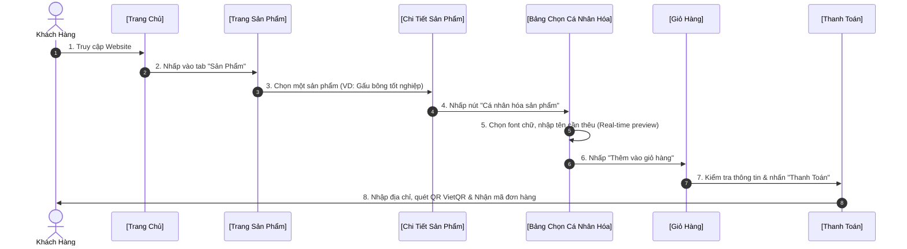
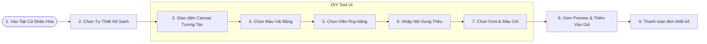
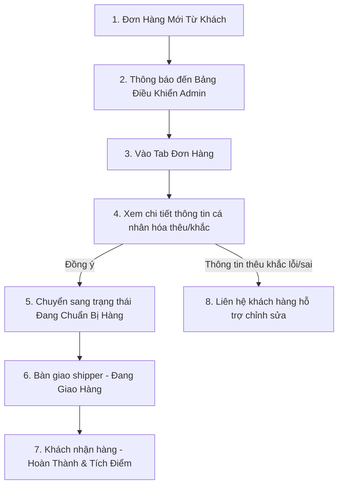

# 📐 SƠ ĐỒ ĐIỀU HƯỚNG & LUỒNG TRẢI NGHIỆM NGƯỜI DÙNG (UI/UX SITEMAP & USER FLOW)
**Dự án:** Gradie - Quà Tặng Tốt Nghiệp Cao Cấp  
**Mục tiêu:** Phục vụ báo cáo, trình bày đồ án tốt nghiệp, đồ án môn học hoặc portfolio thiết kế UI/UX.

---

## 🗺️ 1. SƠ ĐỒ CẤU TRÚC PHÂN CẤP TRANG (INFORMATION ARCHITECTURE - IA)

Sơ đồ cây (Tree Sitemap) thể hiện cách tổ chức thông tin trên website Gradie từ trang chủ đến các trang con.

```
📍 TRANG CHỦ (index.html)
 ├── 🧭 THANH ĐIỀU HƯỚNG CHÍNH (Header Tabs)
 │    ├── 🏠 Trang Chủ (index.html)
 │    ├── 🎒 Sản Phẩm (products.html)
 │    │    ├── 🧸 Gấu Bông Tốt Nghiệp (personalized-plushies.html)
 │    │    ├── 🎓 Dải Băng Tốt Nghiệp / Sash (graduation-sashes.html)
 │    │    ├── 💐 Combo Quà Tặng & Hoa (gift-combos-flowers.html)
 │    │    ├── 🏅 Huy Chương Danh Dự (accessories-jewelry.html)
 │    │    ├── 🖼️ Khung Ảnh Kỷ Niệm (unique-gifts.html)
 │    │    └── 📄 Chi Tiết Sản Phẩm (product-detail.html)
 │    ├── 🪄 Cá Nhân Hóa (customize.html)
 │    │    ├── 🧵 Dịch Vụ Thêu Tên (embroidery-services.html)
 │    │    ├── ✒️ Dịch Vụ Khắc Tên (engraving-services.html)
 │    │    ├── 🎁 Dịch Vụ Gói Quà Nghệ Thuật (gift-wrapping.html)
 │    │    └── ✂️ Tự Thiết Kế Ribbon/Sash (diy-sash-design.html)
 │    ├── 🖼️ Góc Khách Hàng (gallery.html)
 │    │    └── 📸 Ảnh Thực Tế (customer-photos.html)
 │    ├── 📖 Góc Cảm Hứng (blog.html)
 │    └── 📞 Liên Hệ (contact.html)
 │
 ├── 👤 HỆ THỐNG TÀI KHOẢN & TIỆN ÍCH (Utility Icons)
 │    ├── 🔍 Bộ Tìm Kiếm Nhanh (Search Popup)
 │    ├── 🔑 Đăng Nhập / Đăng Ký (login.html / signup.html)
 │    └── 🤵 Trang Cá Nhân (account.html)
 │         ├── 📋 Lịch Sử Đơn Hàng
 │         └── 🎫 Điểm Tích Lũy & Thẻ Thành Viên
 │
 ├── 🛒 GIỎ HÀNG & MUA HÀNG (Checkout Funnel)
 │    ├── 🛍️ Giỏ Hàng (cart.html)
 │    ├── 💳 Tiến Hành Thanh Toán (checkout.html)
 │    │    └── 📱 Quét Mã QR VietQR (vietqr.js)
 │    └── 📦 Theo Dõi Đơn Hàng (order-tracking.html)
 │
 └── 📄 THÔNG TIN BỔ TRỢ (Footer Links)
      ├── 🤝 Câu Chuyện Thương Hiệu (brand-story.html)
      ├── 🎯 Sứ Mệnh & Tầm Nhìn (mission.html)
      ├── 💡 Ý Tưởng Chụp Ảnh Kỷ Yếu (photoshoot-concepts.html)
      ├── 🛡️ Chính Sách Cửa Hàng (store-policy.html)
      └── 📜 Hướng Dẫn Chọn Quà (gifting-tips.html / meaning-of-gifts.html)
```

---

## 🔄 2. LUỒNG TRẢI NGHIỆM NGƯỜI DÙNG (USER FLOWS)

Dưới đây là 3 luồng đi quan trọng nhất của khách hàng (Client) và quản trị viên (Admin) được thiết kế tối ưu hóa tỷ lệ chuyển đổi (CR) và trải nghiệm (UX).

### Luồng 1: Mua hàng kết hợp Tùy chỉnh/Cá nhân hóa sản phẩm (Core UX Flow)
*Đây là điểm đặc sắc nhất của Gradie (thêu tên lên gấu bông hoặc khắc chữ lên hộp).*



---

### Luồng 2: Tự thiết kế Dải Băng Tốt Nghiệp (DIY Sash/Ribbon Design Flow)
*Luồng thiết kế tương tác cao (Interactive UI) giúp khách hàng tự phối màu.*



---

### Luồng 3: Quản lý & Xử lý đơn hàng của Admin (Admin Order Processing Flow)
*Hệ thống quản trị nội bộ hỗ trợ vận hành hậu cần.*



---

## 🎨 3. BẢN ĐỒ VỊ TRÍ CÁC TAB & THÀNH PHẦN UI/UX CHÍNH

Bảng liệt kê vị trí, cấu trúc hiển thị và các nút kêu gọi hành động (CTA) tương ứng trên màn hình:

| Màn Hình (Screen) | Vị Trí Tab / Vùng UI | Thành phần tương tác chính (Interactive Elements) | Mục Tiêu UX (UX Goals) |
| :--- | :--- | :--- | :--- |
| **Trang Chủ** | Header / Banner chính | Nút `Mua ngay`, `Tự thiết kế` (Hero CTA) | Thu hút sự chú ý, điều hướng nhanh đến trang bán hàng. |
| **Trang Cửa Hàng** | Cột bên trái / Bộ lọc | Lọc theo danh mục (Category Filter), Tìm kiếm nhanh, Sắp xếp giá | Giúp khách hàng tìm sản phẩm mong muốn trong dưới 3 lượt click. |
| **Chi Tiết Sản Phẩm** | Giữa màn hình | Customization Input Box (Nhập tên thêu, màu chỉ, font chữ) | Tăng trải nghiệm cá nhân hóa, hiển thị trực quan trước khi mua. |
| **Giỏ Hàng** | Toàn màn hình | Nút tăng giảm số lượng, ô hiển thị chi tiết thêu/khắc đã cấu hình | Minh bạch thông tin đơn hàng, giảm tỷ lệ bỏ giỏ hàng. |
| **Thanh Toán** | 2 Cột (Layout song song) | Form thông tin giao hàng + Cổng thanh toán quét mã VietQR tự động | Đơn giản hóa quy trình thanh toán, an toàn, nhanh chóng. |
| **Trang Cá Nhân** | Sidebar bên trái | Lịch sử đơn hàng, Nút `Theo dõi trạng thái` | Xây dựng lòng tin, tạo sự thuận tiện cho khách hàng quay lại mua tiếp. |

---

## 📊 4. PHÂN TÍCH TỐI ƯU HÓA TRẢI NGHIỆM KHÁCH HÀNG (UX OPTIMIZATION)

1.  **Tính năng cá nhân hóa thời gian thực (Real-time Preview)**: Cho phép nhập chữ thêu và hiển thị trực tiếp lên hình mẫu ruy-băng hoặc gấu bông tốt nghiệp giúp tăng lòng tin của khách hàng (giảm rủi ro sai lệch mong đợi).
2.  **Rút ngắn luồng thanh toán (Shortened Checkout Funnel)**: Tích hợp mã QR thanh toán động VietQR. Khách hàng chỉ cần quét mã bằng app ngân hàng là thông tin tài khoản và số tiền tự động điền sẵn, hạn chế tối đa sai sót thủ công.
3.  **Hệ thống thiết kế tự do (DIY Sash Studio)**: Giao diện kéo-thả trực quan trên điện thoại và máy tính, tối ưu hóa kích thước nút bấm để thao tác trên màn hình cảm ứng dễ dàng nhất.
